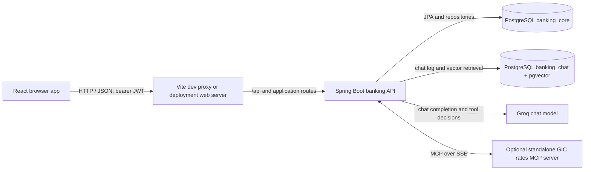

# Voltio Project Overview

This guide is for people visiting the repository or preparing to contribute. It describes the current application boundaries, how a browser request reaches the backend, and where to look when making a change. It is an orientation map rather than a complete API or operations manual.

## What this project contains

Voltio is a full-stack digital banking application. Its browser interface serves retail-customer experiences as well as role-specific administrator, risk analyst, and compliance observer screens. A Spring Boot service owns the HTTP API, authorization, banking rules, and persistence. A separate Spring AI Model Context Protocol (MCP) server provides GIC rate lookup to the savings-insights chatbot.

## Architecture at a glance



In the local Compose configuration, `banking_core` and `banking_chat` are separate databases on the same PostgreSQL/pgvector server. The MCP process is a separate application and can be unavailable without preventing the backend from starting; chatbot answers may then lack GIC rate data.

## Repository map

| Area | What it owns | Where to start |
|---|---|---|
| Browser application | Route composition, screens, reusable UI, session and theme state | [`src/App.jsx`](../../../src/App.jsx), [`src/pages/`](../../../src/pages/), [`src/components/`](../../../src/components/) |
| Frontend API and state | Shared HTTP clients, endpoint wrappers, request state and reusable feature hooks | [`src/api/`](../../../src/api/), [`src/hooks/`](../../../src/hooks/), [`src/auth/`](../../../src/auth/) |
| Banking API | REST controllers and request/response DTOs | [`backend/src/main/java/com/group1/banking/controller/`](../../../backend/src/main/java/com/group1/banking/controller/), [`backend/src/main/java/com/group1/banking/dto/`](../../../backend/src/main/java/com/group1/banking/dto/) |
| Banking/domain behavior | Business operations, entities, repositories, mappings and validation | [`backend/src/main/java/com/group1/banking/service/`](../../../backend/src/main/java/com/group1/banking/service/), [`backend/src/main/java/com/group1/banking/entity/`](../../../backend/src/main/java/com/group1/banking/entity/), [`backend/src/main/java/com/group1/banking/repository/`](../../../backend/src/main/java/com/group1/banking/repository/) |
| Backend security and configuration | JWT authentication, authorization, CORS, data sources, AI/MCP wiring and exception translation | [`backend/src/main/java/com/group1/banking/security/`](../../../backend/src/main/java/com/group1/banking/security/), [`backend/src/main/java/com/group1/banking/config/`](../../../backend/src/main/java/com/group1/banking/config/), [`backend/src/main/java/com/group1/banking/exception/GlobalExceptionHandler.java`](../../../backend/src/main/java/com/group1/banking/exception/GlobalExceptionHandler.java) |
| Persistence and runtime settings | Database schema migrations, application settings, seed data and container initialization | [`backend/src/main/resources/`](../../../backend/src/main/resources/), [`docker/`](../../../docker/), [`docker-compose.yml`](../../../docker-compose.yml) |
| GIC rates MCP service | Standalone MCP server and its rate lookup tool | [`voltio-rates-mcp-server/src/main/java/com/voltio/mcptestserver/`](../../../voltio-rates-mcp-server/src/main/java/com/voltio/mcptestserver/), [`voltio-rates-mcp-server/pom.xml`](../../../voltio-rates-mcp-server/pom.xml) |
| Tests | Frontend component/page tests and backend controller, service, repository, security and integration tests | [`src/test/`](../../../src/test/), [`backend/src/test/java/com/group1/banking/`](../../../backend/src/test/java/com/group1/banking/), [`voltio-rates-mcp-server/src/test/`](../../../voltio-rates-mcp-server/src/test/) |
| Build and deployment support | Frontend/backend build definitions, container setup and deployment manifests | [`package.json`](../../../package.json), [`backend/pom.xml`](../../../backend/pom.xml), [`dockerfile`](../../../dockerfile), [`k8s/`](../../../k8s/), [`cloudbuild.yaml`](../../../cloudbuild.yaml) |
| Project guidance | Local setup, feature specifications and contributor-facing documentation | [`SETUP.md`](../../../SETUP.md), [`specs/`](../../../specs/), [`Documentation/`](../../) |

The frontend source is organized by UI responsibility: `pages` compose routes, `components` provide reusable presentation, `hooks` encapsulate reusable data/state behavior, and `api` centralizes backend calls. Backend packages follow responsibility boundaries: controllers handle HTTP, services own application/domain operations, repositories access persisted records, and DTOs define transport shapes.

## How a normal request travels

1. The user interacts with a React page or component. Routes and role-aware route wrappers are composed in `src/App.jsx`.
2. A page calls a hook or a function in `src/api/`. API calls use the shared Axios clients in `src/api/axiosClient.js`, which attach the current JWT and map backend errors to a consistent frontend shape.
3. In local development, Vite forwards API requests to the backend. In deployment, the configured web server provides the equivalent frontend/API routing.
4. Spring Security's JWT filter establishes the authenticated principal. URL-level and method-level rules apply role, permission, and (where needed) resource-ownership checks.
5. A controller validates and maps the request, then delegates to a service. Services enforce business rules and use repositories/entities to read or change banking data.
6. The response travels back through the shared API client to the calling hook/page. Backend exceptions are translated to structured HTTP error responses by the global exception handler.

### Example: transferring between accounts

```text
TransferPage
  -> src/api/accounts.js: transferBetweenAccounts()
  -> shared Axios client (JWT + Idempotency-Key)
  -> Vite proxy in development
  -> AccountController: POST /accounts/transfer
  -> MonetaryOperationService: authorization, validation, transaction handling
  -> account / transaction / idempotency repositories
  -> banking_core
  -> JSON result -> TransferPage success or mapped error
```

The browser performs basic form checks for user experience, but the backend remains authoritative for permissions and banking invariants. The transfer request uses an idempotency key so a retry can be recognized rather than treated as a second independent operation.

## Chatbot request flow

The Savings Insight chat follows the same authenticated browser-to-API path, with additional data and model integrations:

1. `ChatWidget` uses the savings-chat hook and `src/api/chat.js` to send a message to `POST /api/chat/savings-insights`.
2. `SavingsInsightChatController` obtains the authenticated customer's identity and delegates to `SavingsInsightChatService`.
3. The service applies a scope/guardrail check, binds the customer context to the model turn, and invokes the configured chat client. Backend tools can retrieve customer-specific banking context and approved knowledge-base material from `banking_chat`/pgvector.
4. When useful, the model can call the standalone `voltio-rates-mcp-server` GIC lookup tool over MCP/SSE. The model integration is configured in backend properties; the MCP server is not the browser's API.
5. The backend returns the answer and its available citations/status to the widget and records the interaction. If the MCP service is down, the chat can return a degraded answer rather than requiring that optional service for backend startup.

An agent-proposed money movement is not executed merely because the model suggests it. The confirmation flow is exposed separately through the authenticated chat-confirmation endpoint and requires an explicit customer action in the UI.

## Data and trust boundaries

- **`banking_core`** holds application identity and banking records such as users, customers, accounts, transactions, goals, and other feature data. The backend's schema is managed/checked through its database migration and JPA configuration.
- **`banking_chat`** is a separate database for the chatbot's interaction log and pgvector knowledge store. It is accessed through dedicated chatbot data-source configuration rather than the primary banking repositories.
- **The model and MCP server are dependencies**, not sources of authorization. Customer identity and permissions are established by the backend. Sensitive customer-specific tool calls receive backend-supplied customer context; clients must not be treated as authoritative for another customer's identifiers.
- **The MCP server is an independently deployable process.** Its rate values are provided by the MCP module and should not be confused with the backend's GIC account and investment operations.
- Runtime URLs, credentials, model keys, and feature flags are configuration inputs. Use the root `.env.example` and [developer setup guide](../../../SETUP.md) to orient yourself; do not commit real credentials.

### Configuration drift to resolve

The repository currently has conflicting database descriptions: the developer setup text and older comments in the datasource configuration mention H2/MySQL for core banking data, while the active [application properties](../../../backend/src/main/resources/application.properties) default `spring.datasource.url` to PostgreSQL `banking_core`, and [docker-compose.yml](../../../docker-compose.yml) creates both `banking_chat` and `banking_core`. Check the active profile and environment overrides before relying on a local database assumption; treat the runtime properties and Compose setup as the current configuration evidence.

## Where to go next as a contributor

| If your change is about… | Start here |
|---|---|
| A screen, route, or interaction | `src/pages/`, `src/components/`, then the route composition in `src/App.jsx` |
| A browser-to-backend call | `src/api/`, `src/hooks/`, and the corresponding backend controller |
| Authorization or identity | `src/auth/`, backend `security/`, `config/SecurityConfig.java`, and controller authorization annotations |
| Banking rules or persisted records | Backend `service/`, `entity/`, `repository/`, and the related tests |
| Savings Insight chat or GIC rates | `src/components/ChatWidget.jsx`, backend chat services/configuration, and `voltio-rates-mcp-server/` |
| Database schema or local dependencies | `backend/src/main/resources/db/`, `backend/src/main/resources/application.properties`, `docker-compose.yml` |

Use [SETUP.md](../../../SETUP.md) for current local run and test commands. Frontend scripts are defined in [package.json](../../../package.json); backend and MCP builds/tests use their Maven wrappers and `pom.xml` files. Tests are grouped alongside their functional areas where applicable; inspect the nearest test before changing behavior.

## Keeping this guide accurate

When a contribution changes a major source area, component boundary, database/integration relationship, or flow described here, update this overview and its links in the same change. Keep it concise and verify repository paths and runtime configuration against the checked-in source instead of copying old comments or assumptions.
